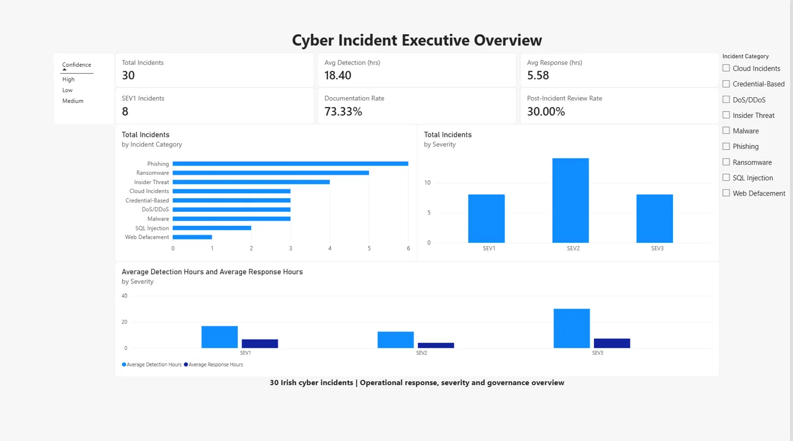
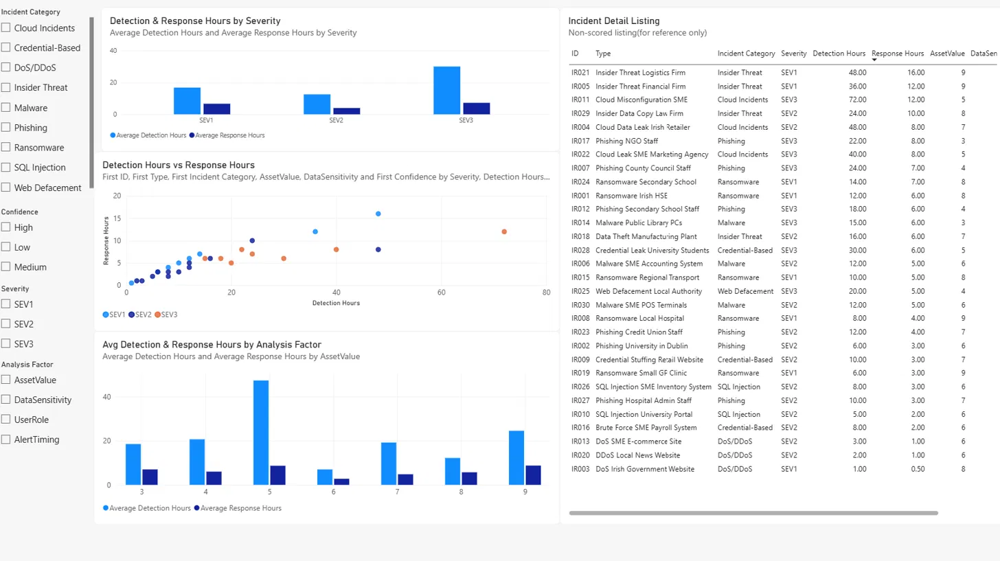
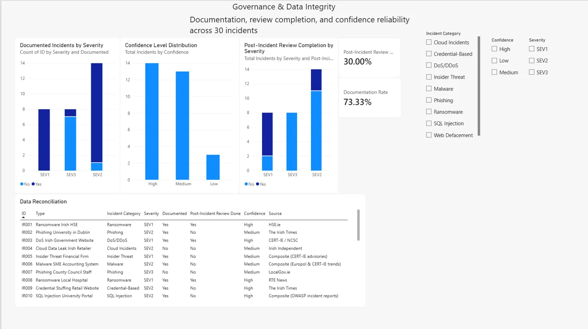

# Cyber Incident Response Dashboard | Power BI

An interactive three-page Power BI cybersecurity analytics project built from an Ireland-focused 30-incident research dataset developed during my MSc. The project combines Power Query transformation, context-aware DAX measures, dynamic Field Parameters, operational response analysis, and governance reporting.

## Dashboard Preview

### Executive Overview


### Risk & Response Analysis


### Governance & Data Integrity


## Project Overview

This dashboard turns a structured incident dataset into three interactive report pages covering operational response performance, risk correlation, and governance/data integrity. It was built to demonstrate practical Power BI skills, including Power Query transformation, DAX measure design, and dashboard UX, on a real (if small-scale) security dataset, and to make the underlying MSc research explorable rather than locked in a static PDF.

## The Analytical Problem

Lean Security Operations Centres (SOCs), including small teams in SMEs, hospitals, local authorities, and universities, often lack the tooling to answer basic operational questions: How fast are we detecting and responding to incidents? Are higher-severity incidents actually getting faster response? Are we documenting and reviewing incidents consistently? This dashboard answers those questions for the incident set below and provides a template that a lean SOC could adapt to its own incident log.

## Dataset

- 30 annotated Irish-context cyber incidents (`data/Dataset.xlsx`)
- Fields: incident ID, type, incident category, severity (SEV1-SEV3), detection hours, response hours, documentation status, post-incident review status, asset value, data sensitivity, user role, alert timing, confidence, source
- Companion to the [Ireland Cyber Incident Dataset on Kaggle](https://www.kaggle.com/datasets/khajithmoses/ireland-cyber-incident-dataset) and the [lean-soc-cir-framework](https://github.com/khajithmoses/lean-soc-cir-framework) MSc project

**Scope note:** this is a 30-incident research/demonstration dataset, not a statistically representative sample of Irish cybercrime. Findings below describe *this dataset* (e.g. "Phishing and Ransomware account for 36.7% of these 30 incidents"), not the Irish threat landscape as a whole.

## Dashboard Pages

### 1. Executive Overview
KPI cards (Total Incidents, Avg Detection Hours, Avg Response Hours, SEV1 Incidents, Documentation Rate, Post-Incident Review Rate), incidents by category, incidents by severity, and average detection/response hours by severity. Slicers: Incident Category, Confidence.

### 2. Risk & Response Analysis
Detection vs. response hours scatter plot (per-incident, coloured by severity), average detection/response hours by severity, and a **dynamic Field Parameter chart** letting the user switch the analysis dimension between Asset Value, Data Sensitivity, User Role, and Alert Timing to compare detection and response performance across contextual factors. Includes a full incident detail table sorted by response hours (descending). Slicers: Incident Category, Confidence, Severity.

### 3. Governance & Data Integrity
Documentation Rate and Post-Incident Review Rate KPI cards, documented/reviewed incidents by severity (stacked columns), confidence-level distribution (High to Medium to Low), and a full reconciliation table (sorted by incident ID) listing every incident's documentation status, review status, confidence rating, and source. Slicers: Incident Category, Confidence, Severity.

## Data Preparation (Power Query)

- Source table kept untouched as a reference query (`CyberIncidents_Raw`); all transformation done on a downstream reference table to preserve an auditable original.
- Explicit type casting: text fields (ID, Type, Severity, Documented, PIR, Confidence, Source) as Text; hour fields and User Role as Decimal Number; Asset Value, Data Sensitivity, Alert Timing as Whole Number.
- Text trimming on Type and Source to remove inconsistent whitespace.
- Custom **Incident Category** column derived via `Text.Contains` pattern matching against the incident `Type` field, mapping the 30 incidents into 9 categories.

### Documented data decisions

**PIR column relabel.** The source spreadsheet's column header reads *"Priority Intelligence Requirements (PIR) Done"*. This project's MSc framework and dashboard use PIR to mean **Post-Incident Review**, consistent with standard incident-response terminology (NIST SP 800-61). The column was renamed to `Post-Incident Review Done` during the Power Query stage rather than left under its original, differently-intentioned label. This is a disclosed relabeling, not a claim that the source data was originally captured under that name.

**Incident category taxonomy.** The dashboard's 9-category taxonomy (Ransomware, Phishing, DoS/DDoS, Cloud Incidents, Insider Threat, SQL Injection, Credential-Based, Malware, Web Defacement) deliberately keeps **Credential-Based** as its own category. The original MSc report's category breakdown (Fig 3.1) folded credential-related incidents into the broader Phishing and Malware categories. Both are defensible groupings; this dashboard uses the more granular split because it surfaces credential-stuffing/brute-force patterns that would otherwise be hidden inside Phishing and Malware totals.

## Data Model & DAX Measures

Single-table model (`CyberIncidents`), nine measures:

```dax
Total Incidents = COUNTROWS(CyberIncidents)
Average Detection Hours = AVERAGE(CyberIncidents[Detection Hours])
Average Response Hours = AVERAGE(CyberIncidents[Response Hours])

SEV1 Incidents =
    CALCULATE(COUNTROWS(CyberIncidents), CyberIncidents[Severity] = "SEV1") + 0

SEV1 % =
    VAR SEV1Count = CALCULATE(COUNTROWS(CyberIncidents), CyberIncidents[Severity] = "SEV1")
    VAR TotalIgnoringSeverity = CALCULATE(COUNTROWS(CyberIncidents), REMOVEFILTERS(CyberIncidents[Severity]))
    RETURN DIVIDE(SEV1Count, TotalIgnoringSeverity, 0)

Documented Incidents =
    CALCULATE(COUNTROWS(CyberIncidents), CyberIncidents[Documented] = "Yes") + 0

Documentation Rate =
    VAR DocumentedCount = CALCULATE(COUNTROWS(CyberIncidents), CyberIncidents[Documented] = "Yes")
    VAR TotalIgnoringDocumented = CALCULATE(COUNTROWS(CyberIncidents), REMOVEFILTERS(CyberIncidents[Documented]))
    RETURN DIVIDE(DocumentedCount, TotalIgnoringDocumented, 0)

Post-Incident Reviews Completed =
    CALCULATE(COUNTROWS(CyberIncidents), CyberIncidents[Post-Incident Review Done] = "Yes") + 0

Post-Incident Review Completion Rate =
    VAR PIRCount = CALCULATE(COUNTROWS(CyberIncidents), CyberIncidents[Post-Incident Review Done] = "Yes")
    VAR TotalIgnoringPIR = CALCULATE(COUNTROWS(CyberIncidents), REMOVEFILTERS(CyberIncidents[Post-Incident Review Done]))
    RETURN DIVIDE(PIRCount, TotalIgnoringPIR, 0)
```

**A deliberate `+ 0` fix** was applied to the three count measures (SEV1 Incidents, Documented Incidents, Post-Incident Reviews Completed). By default, `CALCULATE(COUNTROWS(...), <condition>)` renders **blank** rather than `0` in a card visual when a filter context (e.g. a slicer selection) leaves zero matching rows. Since a KPI card silently showing nothing looks like a broken visual rather than a true zero, `+ 0` forces the measure to resolve to a real numeric zero in that case. Full derivation and reasoning documented in `docs/dax-measures.md`.

## Interactive Functionality

- Interactive slicers and visual cross-filtering across report visuals (Incident Category, Confidence, Severity) on every page.
- A **Field Parameter** ("Analysis Factor") on Page 2 lets the user swap the risk-driver chart's X-axis between Asset Value, Data Sensitivity, User Role, and Alert Timing without building four separate charts.
- Per-incident tooltips on the scatter chart (ID, Type, Category, Asset Value, Data Sensitivity, Confidence) for drill-down without leaving the chart.

## Key Findings

*(Framed as descriptive statistics about this 30-incident dataset only.)*

- Average detection time across all incidents: **18.4 hours**; average response time: **5.58 hours**.
- SEV2 incidents are the largest severity group in this dataset (14 of 30) and, notably, show the **lowest** Post-Incident Review completion share of the three severity tiers, a governance gap worth flagging in a real SOC even at this sample size.
- Phishing and Ransomware together account for **36.7%** of the 30 incidents, the two largest categories in this dataset.
- Documentation Rate: **73.33%**; Post-Incident Review Completion Rate: **30.00%**, a wide gap between "we wrote it down" and "we reviewed it afterward."
- The dynamic Analysis Factor visual enables comparison of detection and response performance across Asset Value, Data Sensitivity, User Role, and Alert Timing without imposing a composite risk score.

Full write-up in `docs/findings.md`.

## Validation & Data Integrity

Before any modelling, the source spreadsheet was checked field-by-field against the MSc dissertation's reported statistics: record count (30), average detection/response hours, SEV1 count, documentation rate, PIR rate, and severity split (26.7% / 46.7% / 26.7% for SEV1/SEV2/SEV3) all matched. Zero null values and zero duplicate IDs or rows were found.

**Design decision: no Severity slicer on Page 1.** The `SEV1 Incidents` KPI explicitly evaluates SEV1 records. A Severity slicer on the same executive page could therefore create a confusing user experience when another severity is selected. Page 1 intentionally uses only Incident Category and Confidence slicers, while Severity filtering remains available on the analytical pages. Full filter-context reasoning in `docs/dax-measures.md`.

## Limitations

- Sample size (n=30) is too small to support population-level claims about Irish cyber incidents; treat all findings as descriptive of this dataset.
- Some source fields use non-obvious scales (e.g. Alert Timing is scored 1-5, not the 1-10 scale implied by the dissertation narrative), documented in `docs/methodology.md`.
- Incident category assignment relies on keyword pattern-matching against the `Type` field and may misclassify edge cases involving multiple attack techniques.
- Confidence ratings (High/Medium/Low) reflect source-attribution confidence, not incident-severity confidence, and should not be conflated with the Severity field.

Full details in `docs/limitations.md`.

## Repository Structure

```text
ireland-cyber-incident-powerbi/
│
├── README.md
│
├── dashboard/
│   └── Ireland-Cyber-Incident-Dashboard.pbix
│
├── data/
│   └── Dataset.xlsx
│
├── docs/
│   ├── methodology.md
│   ├── findings.md
│   ├── limitations.md
│   └── dax-measures.md
│
└── screenshots/
    ├── 01-executive-overview.png
    ├── 02-risk-response-analysis.png
    └── 03-governance-data-integrity.png
```

## Related Work

- **[lean-soc-cir-framework](https://github.com/khajithmoses/lean-soc-cir-framework)**: the MSc dissertation project this dashboard's dataset originates from, a lightweight, YAML-driven cybersecurity incident response framework for lean SOCs, with weighted severity classification and AI-hybrid queue prioritisation.
- **[Ireland Cyber Incident Dataset (Kaggle)](https://www.kaggle.com/datasets/khajithmoses/ireland-cyber-incident-dataset)**: the underlying dataset, published for reuse by other researchers.
